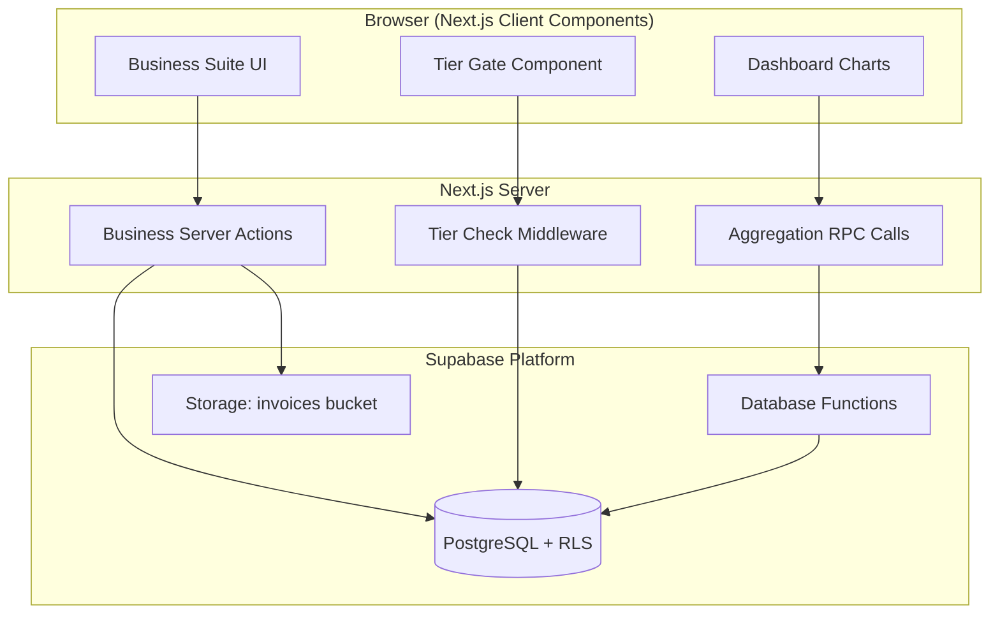
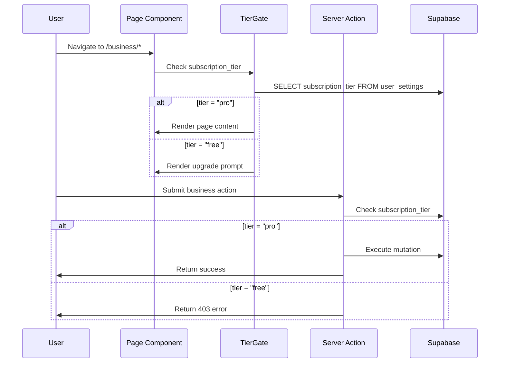
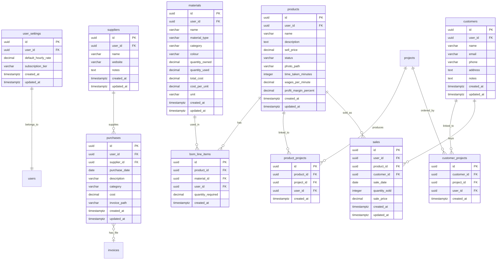

# Design Document: Business Suite

## Overview

The Business Suite extends the existing "Wired for Crochet" project tracker into a full business management tool. It adds expense tracking, product catalog management, enhanced materials inventory, bill of materials costing, customer and supplier databases, sales recording, and a business dashboard — all gated behind a PRO subscription tier.

### Key Design Decisions

| Decision | Choice | Rationale |
|----------|--------|-----------|
| Tier gating | `subscription_tier` column on `user_settings` + middleware + server action guards | Single source of truth, enforced at both UI and API layers |
| Materials strategy | New `materials` table + view that unions with `yarn_entries` | Preserves existing yarn data, extends to non-yarn materials without breaking changes |
| BOM architecture | Separate `bom_line_items` table referencing `materials` | Decoupled from project pricing; product-level costing vs project-level |
| Invoice storage | Supabase Storage `invoices` bucket (private) | Consistent with existing photo/pattern storage pattern |
| Dashboard aggregation | Server-side SQL aggregation via Supabase RPC functions | Avoids fetching all records client-side; performant for large datasets |
| Revenue tracking | Dedicated `sales` table | Clean separation from expenses; enables proper income/expense reporting |
| Currency | Inherits per-project currency from existing system | No new currency logic needed |

---

## Architecture

### System Architecture (Business Suite Extension)



### Tier Gating Flow



### Folder Structure (New Additions)

```
src/
├── app/(dashboard)/
│   └── business/
│       ├── layout.tsx              # Tier gate wrapper
│       ├── page.tsx                # Business dashboard
│       ├── expenses/
│       │   ├── page.tsx            # Expense list
│       │   └── new/page.tsx        # Add expense
│       ├── sales/
│       │   ├── page.tsx            # Sales list
│       │   └── new/page.tsx        # Record sale
│       ├── products/
│       │   ├── page.tsx            # Product catalog
│       │   ├── new/page.tsx        # Add product
│       │   └── [id]/
│       │       ├── page.tsx        # Product detail
│       │       └── bom/page.tsx    # Bill of materials
│       ├── materials/
│       │   ├── page.tsx            # Materials inventory
│       │   └── new/page.tsx        # Add material
│       ├── customers/
│       │   ├── page.tsx            # Customer list
│       │   └── [id]/page.tsx       # Customer detail
│       └── suppliers/
│           ├── page.tsx            # Supplier list
│           └── [id]/page.tsx       # Supplier detail
├── components/
│   └── business/
│       ├── TierGate.tsx            # Subscription gate wrapper
│       ├── UpgradePrompt.tsx       # Upgrade CTA component
│       ├── ExpenseForm.tsx         # Expense create/edit form
│       ├── SaleForm.tsx            # Sale recording form
│       ├── ProductForm.tsx         # Product create/edit form
│       ├── MaterialForm.tsx        # Material create/edit form
│       ├── BomEditor.tsx           # BOM line item editor
│       ├── BomBreakdown.tsx        # BOM cost breakdown display
│       ├── CustomerForm.tsx        # Customer create/edit form
│       ├── SupplierForm.tsx        # Supplier create/edit form
│       ├── DashboardSummary.tsx    # Financial summary cards
│       ├── ExpenseCategoryChart.tsx # Expense breakdown chart
│       └── InvoiceUploader.tsx     # Invoice file upload
├── lib/
│   ├── actions/
│   │   ├── business-gate.ts       # Tier check helper
│   │   ├── expenses.ts            # Expense CRUD actions
│   │   ├── sales.ts               # Sales CRUD actions
│   │   ├── products.ts            # Product CRUD actions
│   │   ├── materials.ts           # Material CRUD actions
│   │   ├── bom.ts                 # BOM management actions
│   │   ├── customers.ts           # Customer CRUD actions
│   │   ├── suppliers.ts           # Supplier CRUD actions
│   │   └── dashboard.ts           # Dashboard aggregation actions
│   ├── validators/
│   │   ├── expense.ts             # Expense Zod schemas
│   │   ├── sale.ts                # Sale Zod schemas
│   │   ├── product.ts             # Product Zod schemas
│   │   ├── material.ts            # Material Zod schemas
│   │   ├── bom.ts                 # BOM Zod schemas
│   │   ├── customer.ts            # Customer Zod schemas
│   │   └── supplier.ts            # Supplier Zod schemas
│   └── bom-calculator.ts          # BOM cost calculation logic (pure)
└── types/
    └── business.ts                 # Business suite TypeScript types
```

---

## Components and Interfaces

### Tier Gating Components

| Component | Props | Description |
|-----------|-------|-------------|
| `TierGate` | `children, fallback?` | Server component that checks `subscription_tier` and renders children (pro) or upgrade prompt (free) |
| `UpgradePrompt` | `featureName?` | Displays upgrade CTA with feature description |

### Business Page Components

| Component | Props | Description |
|-----------|-------|-------------|
| `ExpenseForm` | `expense?, suppliers[]` | Create/edit expense with category, supplier, date, cost, invoice upload |
| `SaleForm` | `sale?, products[], customers[]` | Record a sale with product, quantity, price, customer |
| `ProductForm` | `product?` | Create/edit product with name, description, sell price, photo, status |
| `MaterialForm` | `material?` | Create/edit material with name, type, category, quantity, cost |
| `BomEditor` | `productId, lineItems[], materials[]` | Add/remove/edit BOM line items for a product |
| `BomBreakdown` | `bomData` | Display material cost, labour cost, extras, total, suggested price |
| `CustomerForm` | `customer?` | Create/edit customer with name, email, phone, address, notes |
| `SupplierForm` | `supplier?` | Create/edit supplier with name, website, notes |
| `DashboardSummary` | `metrics` | Cards showing total expenses, revenue, profit/loss, stock value |
| `ExpenseCategoryChart` | `categoryBreakdown[]` | Bar/pie chart of expenses by category |
| `InvoiceUploader` | `onUploadComplete` | File upload for PDF/JPEG/PNG invoices (max 10MB) |

### Server Actions Interface

```typescript
// Tier gating
assertProTier(): Promise<void>  // Throws if not pro tier
getSubscriptionTier(): Promise<'free' | 'pro'>

// Expenses
createExpense(prevState, formData: FormData): Promise<ActionState>
updateExpense(id: string, prevState, formData: FormData): Promise<ActionState>
deleteExpense(id: string): Promise<ActionState>
getExpenses(filters?: ExpenseFilters): Promise<{ data: Purchase[] | null; error: string | null }>

// Sales
createSale(prevState, formData: FormData): Promise<ActionState>
updateSale(id: string, prevState, formData: FormData): Promise<ActionState>
deleteSale(id: string): Promise<ActionState>
getSales(filters?: SaleFilters): Promise<{ data: Sale[] | null; error: string | null }>

// Products
createProduct(prevState, formData: FormData): Promise<ActionState>
updateProduct(id: string, prevState, formData: FormData): Promise<ActionState>
deleteProduct(id: string): Promise<ActionState>
getProducts(includeDiscontinued?: boolean): Promise<{ data: Product[] | null; error: string | null }>
linkProductToProject(productId: string, projectId: string): Promise<ActionState>

// Materials
createMaterial(prevState, formData: FormData): Promise<ActionState>
updateMaterial(id: string, prevState, formData: FormData): Promise<ActionState>
deleteMaterial(id: string): Promise<ActionState>
getMaterials(filters?: MaterialFilters): Promise<{ data: Material[] | null; error: string | null }>

// BOM
addBomLineItem(productId: string, prevState, formData: FormData): Promise<ActionState>
updateBomLineItem(id: string, prevState, formData: FormData): Promise<ActionState>
removeBomLineItem(id: string): Promise<ActionState>
getBomForProduct(productId: string): Promise<{ data: BomData | null; error: string | null }>
calculateBomCost(productId: string): Promise<BomCostBreakdown>

// Customers
createCustomer(prevState, formData: FormData): Promise<ActionState>
updateCustomer(id: string, prevState, formData: FormData): Promise<ActionState>
deleteCustomer(id: string): Promise<ActionState>
getCustomers(search?: string): Promise<{ data: Customer[] | null; error: string | null }>
linkCustomerToProject(customerId: string, projectId: string): Promise<ActionState>

// Suppliers
createSupplier(prevState, formData: FormData): Promise<ActionState>
updateSupplier(id: string, prevState, formData: FormData): Promise<ActionState>
deleteSupplier(id: string): Promise<ActionState>
getSuppliers(search?: string): Promise<{ data: Supplier[] | null; error: string | null }>

// Dashboard
getDashboardMetrics(dateRange?: DateRange): Promise<DashboardMetrics>
```

---

## Data Models

### Database Schema Diagram (Business Suite)



### New/Modified Table Definitions

#### `user_settings` (MODIFIED — add column)

| Column | Type | Constraints | Description |
|--------|------|-------------|-------------|
| subscription_tier | varchar(10) | NOT NULL, DEFAULT 'free', CHECK IN ('free', 'pro') | User's subscription level |

#### `suppliers`

| Column | Type | Constraints | Description |
|--------|------|-------------|-------------|
| id | uuid | PK, DEFAULT gen_random_uuid() | |
| user_id | uuid | FK → auth.users, NOT NULL | Owner |
| name | varchar(255) | NOT NULL | Supplier name |
| website | varchar(500) | nullable | Supplier website URL |
| notes | text | nullable | Additional notes |
| created_at | timestamptz | NOT NULL, DEFAULT now() | |
| updated_at | timestamptz | NOT NULL, DEFAULT now() | |

#### `purchases`

| Column | Type | Constraints | Description |
|--------|------|-------------|-------------|
| id | uuid | PK, DEFAULT gen_random_uuid() | |
| user_id | uuid | FK → auth.users, NOT NULL | Owner |
| supplier_id | uuid | FK → suppliers, nullable | Linked supplier |
| purchase_date | date | NOT NULL | Date of purchase |
| description | varchar(500) | NOT NULL | What was purchased |
| category | varchar(30) | NOT NULL, CHECK IN ('equipment', 'stock', 'subscription', 'books', 'office_supplies') | Expense category |
| cost | decimal(10,2) | NOT NULL, CHECK >= 0 | Amount spent |
| invoice_path | text | nullable | Storage path for invoice file |
| invoice_file_name | varchar(255) | nullable | Original filename |
| created_at | timestamptz | NOT NULL, DEFAULT now() | |
| updated_at | timestamptz | NOT NULL, DEFAULT now() | |

#### `materials`

| Column | Type | Constraints | Description |
|--------|------|-------------|-------------|
| id | uuid | PK, DEFAULT gen_random_uuid() | |
| user_id | uuid | FK → auth.users, NOT NULL | Owner |
| name | varchar(255) | NOT NULL | Material name |
| material_type | varchar(50) | nullable | Specific type (e.g., acrylic, cotton, metal) |
| category | varchar(20) | NOT NULL, CHECK IN ('yarn', 'accessories', 'hardware', 'tools') | Material category |
| colour | varchar(100) | nullable | Colour name |
| quantity_owned | decimal(10,2) | NOT NULL, DEFAULT 0 | Total quantity in stock |
| quantity_used | decimal(10,2) | NOT NULL, DEFAULT 0 | Total quantity consumed |
| total_cost | decimal(10,2) | nullable | Total cost paid for this material |
| cost_per_unit | decimal(10,4) | GENERATED ALWAYS AS (CASE WHEN quantity_owned > 0 AND total_cost IS NOT NULL THEN total_cost / quantity_owned ELSE NULL END) STORED | Auto-calculated |
| unit | varchar(20) | NOT NULL, DEFAULT 'pieces', CHECK IN ('grams', 'metres', 'pieces', 'skeins') | Unit of measurement |
| created_at | timestamptz | NOT NULL, DEFAULT now() | |
| updated_at | timestamptz | NOT NULL, DEFAULT now() | |

#### `products`

| Column | Type | Constraints | Description |
|--------|------|-------------|-------------|
| id | uuid | PK, DEFAULT gen_random_uuid() | |
| user_id | uuid | FK → auth.users, NOT NULL | Owner |
| name | varchar(255) | NOT NULL | Product name |
| description | text | nullable | Product description |
| sell_price | decimal(10,2) | NOT NULL, CHECK >= 0 | Selling price |
| status | varchar(20) | NOT NULL, DEFAULT 'active', CHECK IN ('active', 'discontinued') | Product status |
| photo_path | text | nullable | Storage path for product photo |
| time_taken_minutes | integer | nullable, CHECK >= 0 | Time to produce |
| wages_per_minute | decimal(10,4) | nullable | Labour rate for BOM |
| profit_margin_percent | decimal(5,2) | nullable | Profit margin % for suggested price |
| created_at | timestamptz | NOT NULL, DEFAULT now() | |
| updated_at | timestamptz | NOT NULL, DEFAULT now() | |

#### `bom_line_items`

| Column | Type | Constraints | Description |
|--------|------|-------------|-------------|
| id | uuid | PK, DEFAULT gen_random_uuid() | |
| product_id | uuid | FK → products, NOT NULL, ON DELETE CASCADE | Parent product |
| material_id | uuid | FK → materials, nullable, ON DELETE SET NULL | Referenced material (null = deleted material) |
| user_id | uuid | FK → auth.users, NOT NULL | Owner |
| quantity_required | decimal(10,2) | NOT NULL, CHECK > 0 | Amount of material needed |
| created_at | timestamptz | NOT NULL, DEFAULT now() | |

#### `customers`

| Column | Type | Constraints | Description |
|--------|------|-------------|-------------|
| id | uuid | PK, DEFAULT gen_random_uuid() | |
| user_id | uuid | FK → auth.users, NOT NULL | Owner |
| name | varchar(255) | NOT NULL | Customer name |
| email | varchar(255) | nullable | Email address |
| phone | varchar(50) | nullable | Phone number |
| address | text | nullable | Postal address |
| notes | text | nullable | Additional notes |
| created_at | timestamptz | NOT NULL, DEFAULT now() | |
| updated_at | timestamptz | NOT NULL, DEFAULT now() | |

#### `sales`

| Column | Type | Constraints | Description |
|--------|------|-------------|-------------|
| id | uuid | PK, DEFAULT gen_random_uuid() | |
| user_id | uuid | FK → auth.users, NOT NULL | Owner |
| product_id | uuid | FK → products, nullable | Product sold |
| customer_id | uuid | FK → customers, nullable | Customer who bought |
| sale_date | date | NOT NULL | Date of sale |
| quantity_sold | integer | NOT NULL, DEFAULT 1, CHECK > 0 | Number of units sold |
| sale_price | decimal(10,2) | NOT NULL, CHECK >= 0 | Total sale amount |
| created_at | timestamptz | NOT NULL, DEFAULT now() | |
| updated_at | timestamptz | NOT NULL, DEFAULT now() | |

#### `product_projects` (junction table)

| Column | Type | Constraints | Description |
|--------|------|-------------|-------------|
| id | uuid | PK, DEFAULT gen_random_uuid() | |
| product_id | uuid | FK → products, NOT NULL, ON DELETE CASCADE | |
| project_id | uuid | FK → projects, NOT NULL, ON DELETE CASCADE | |
| user_id | uuid | FK → auth.users, NOT NULL | Owner |
| created_at | timestamptz | NOT NULL, DEFAULT now() | |
| | | UNIQUE(product_id, project_id) | Prevent duplicates |

#### `customer_projects` (junction table)

| Column | Type | Constraints | Description |
|--------|------|-------------|-------------|
| id | uuid | PK, DEFAULT gen_random_uuid() | |
| customer_id | uuid | FK → customers, NOT NULL, ON DELETE SET NULL | |
| project_id | uuid | FK → projects, NOT NULL, ON DELETE CASCADE | |
| user_id | uuid | FK → auth.users, NOT NULL | Owner |
| created_at | timestamptz | NOT NULL, DEFAULT now() | |
| | | UNIQUE(customer_id, project_id) | Prevent duplicates |

### Row-Level Security Policies

All new tables follow the same RLS pattern as existing tables:

```sql
-- Applied to: suppliers, purchases, materials, products, bom_line_items,
--             customers, sales, product_projects, customer_projects
ALTER TABLE {table_name} ENABLE ROW LEVEL SECURITY;

CREATE POLICY "Users can only access own data"
  ON {table_name}
  FOR ALL
  USING (user_id = auth.uid())
  WITH CHECK (user_id = auth.uid());
```

### Storage Buckets (New)

| Bucket | Access | Max File Size | Allowed MIME Types |
|--------|--------|---------------|-------------------|
| `invoices` | Private (signed URLs) | 10 MB | application/pdf, image/jpeg, image/png |

### Database Functions (RPC)

```sql
-- Dashboard aggregation: total expenses within date range
CREATE OR REPLACE FUNCTION get_total_expenses(
  p_user_id uuid,
  p_start_date date DEFAULT NULL,
  p_end_date date DEFAULT NULL
) RETURNS decimal AS $$
  SELECT COALESCE(SUM(cost), 0)
  FROM purchases
  WHERE user_id = p_user_id
    AND (p_start_date IS NULL OR purchase_date >= p_start_date)
    AND (p_end_date IS NULL OR purchase_date <= p_end_date);
$$ LANGUAGE sql SECURITY DEFINER;

-- Dashboard aggregation: total revenue within date range
CREATE OR REPLACE FUNCTION get_total_revenue(
  p_user_id uuid,
  p_start_date date DEFAULT NULL,
  p_end_date date DEFAULT NULL
) RETURNS decimal AS $$
  SELECT COALESCE(SUM(sale_price), 0)
  FROM sales
  WHERE user_id = p_user_id
    AND (p_start_date IS NULL OR sale_date >= p_start_date)
    AND (p_end_date IS NULL OR sale_date <= p_end_date);
$$ LANGUAGE sql SECURITY DEFINER;

-- Dashboard aggregation: expenses by category
CREATE OR REPLACE FUNCTION get_expenses_by_category(
  p_user_id uuid,
  p_start_date date DEFAULT NULL,
  p_end_date date DEFAULT NULL
) RETURNS TABLE(category varchar, total decimal) AS $$
  SELECT category, COALESCE(SUM(cost), 0) as total
  FROM purchases
  WHERE user_id = p_user_id
    AND (p_start_date IS NULL OR purchase_date >= p_start_date)
    AND (p_end_date IS NULL OR purchase_date <= p_end_date)
  GROUP BY category
  ORDER BY total DESC;
$$ LANGUAGE sql SECURITY DEFINER;

-- Dashboard aggregation: total stock value
CREATE OR REPLACE FUNCTION get_total_stock_value(p_user_id uuid)
RETURNS decimal AS $$
  SELECT COALESCE(SUM(
    CASE WHEN quantity_owned > 0 AND total_cost IS NOT NULL
    THEN (total_cost / quantity_owned) * (quantity_owned - quantity_used)
    ELSE 0 END
  ), 0)
  FROM materials
  WHERE user_id = p_user_id;
$$ LANGUAGE sql SECURITY DEFINER;
```

### BOM Cost Calculator (Pure Function)

```typescript
// src/lib/bom-calculator.ts

export interface BomLineItemInput {
  material_id: string | null  // null = deleted material
  quantity_required: number
  cost_per_unit: number | null  // null = unknown cost
}

export interface BomCostInput {
  line_items: BomLineItemInput[]
  time_taken_minutes: number | null
  wages_per_minute: number | null
  extras: Array<{ description: string; amount: number }>
  profit_margin_percent: number | null
}

export interface BomCostBreakdown {
  material_cost: number
  labour_cost: number
  extras_total: number
  total_production_cost: number
  profit_margin_amount: number
  suggested_sell_price: number
  invalid_line_items: number  // count of items with null material_id
}

export function calculateBomCost(input: BomCostInput): BomCostBreakdown {
  // Only include valid line items (material_id not null)
  const validItems = input.line_items.filter(item => item.material_id !== null)
  const invalidCount = input.line_items.length - validItems.length

  const material_cost = validItems.reduce((sum, item) => {
    return sum + (item.quantity_required * (item.cost_per_unit ?? 0))
  }, 0)

  const labour_cost = (input.time_taken_minutes ?? 0) * (input.wages_per_minute ?? 0)

  const extras_total = input.extras.reduce((sum, extra) => sum + extra.amount, 0)

  const total_production_cost = material_cost + labour_cost + extras_total

  const profit_margin_amount = input.profit_margin_percent
    ? total_production_cost * (input.profit_margin_percent / 100)
    : 0

  const suggested_sell_price = total_production_cost + profit_margin_amount

  return {
    material_cost,
    labour_cost,
    extras_total,
    total_production_cost,
    profit_margin_amount,
    suggested_sell_price,
    invalid_line_items: invalidCount,
  }
}
```


---

## Correctness Properties

*A property is a characteristic or behavior that should hold true across all valid executions of a system—essentially, a formal statement about what the system should do. Properties serve as the bridge between human-readable specifications and machine-verifiable correctness guarantees.*

### Property 1: BOM cost calculation correctness

*For any* set of BOM line items (each with a non-negative quantity_required and a cost_per_unit that may be null), any non-negative time_taken_minutes, any non-negative wages_per_minute, any list of extras with non-negative amounts, and any non-negative profit_margin_percent, the `calculateBomCost` function SHALL:
- compute material_cost as the sum of (quantity_required × cost_per_unit) for all items where material_id is not null (treating null cost_per_unit as 0)
- compute labour_cost as time_taken_minutes × wages_per_minute
- compute extras_total as the sum of all extra amounts
- compute total_production_cost as material_cost + labour_cost + extras_total
- compute suggested_sell_price as total_production_cost × (1 + profit_margin_percent / 100)
- report the count of line items with null material_id as invalid_line_items

**Validates: Requirements 5.2, 5.3, 5.4, 5.5, 5.6, 5.8**

### Property 2: Cost-per-unit auto-calculation

*For any* material with total_cost > 0 and quantity_owned > 0, the cost_per_unit SHALL equal total_cost divided by quantity_owned. For any material where total_cost is null or quantity_owned is 0, cost_per_unit SHALL be null.

**Validates: Requirements 4.3, 4.4**

### Property 3: Available stock computation

*For any* material with quantity_owned ≥ 0 and quantity_used ≥ 0 where quantity_used ≤ quantity_owned, the available stock SHALL equal quantity_owned minus quantity_used.

**Validates: Requirements 4.5, 4.6**

### Property 4: Expense filtering preserves predicate

*For any* set of purchase records and any filter (category, supplier_id, or date range), all records returned by the filter function SHALL satisfy the filter predicate, and no records satisfying the predicate SHALL be excluded from the results.

**Validates: Requirements 2.6, 2.7, 2.8**

### Property 5: Dashboard total expenses equals sum of costs

*For any* set of purchase records with non-negative costs, the dashboard total_expenses metric SHALL equal the sum of all purchase costs. When a date range filter is applied, only purchases within that range SHALL contribute to the sum.

**Validates: Requirements 2.5, 8.1, 8.7**

### Property 6: Dashboard total revenue equals sum of sales

*For any* set of sale records with non-negative sale_prices, the dashboard total_revenue metric SHALL equal the sum of all sale_prices. When a date range filter is applied, only sales within that range SHALL contribute to the sum.

**Validates: Requirements 8.2, 9.2, 8.7**

### Property 7: Dashboard profit equals revenue minus expenses

*For any* total_revenue ≥ 0 and total_expenses ≥ 0, the profit_or_loss metric SHALL equal total_revenue minus total_expenses.

**Validates: Requirements 8.3, 9.3**

### Property 8: Dashboard category breakdown sums to total

*For any* set of purchase records, the sum of all category group totals in the expense breakdown SHALL equal the overall total_expenses value.

**Validates: Requirements 8.4**

### Property 9: Product ranking by revenue

*For any* set of sales linked to products, the top products list SHALL be ordered by total revenue (sum of sale_price per product) in descending order.

**Validates: Requirements 8.5**

### Property 10: Stock value aggregation

*For any* set of materials where each has quantity_owned ≥ 0, quantity_used ≥ 0, and cost_per_unit ≥ 0, the total stock value SHALL equal the sum of ((quantity_owned - quantity_used) × cost_per_unit) for all materials where cost_per_unit is not null.

**Validates: Requirements 8.6**

### Property 11: Enum field validation

*For any* string value, the subscription_tier validator SHALL accept only "free" and "pro"; the expense category validator SHALL accept only "equipment", "stock", "subscription", "books", "office_supplies"; the product status validator SHALL accept only "active" and "discontinued"; the material category validator SHALL accept only "yarn", "accessories", "hardware", "tools"; the material unit validator SHALL accept only "grams", "metres", "pieces", "skeins". All other values SHALL be rejected.

**Validates: Requirements 1.1, 2.2, 3.2, 4.2, 4.7**

### Property 12: Required field validation rejects incomplete data

*For any* expense input missing date or cost, any product input missing name or sell_price, any material input missing name or category, any customer input missing name, any supplier input missing name, or any sale input missing date or sale_price, the respective validator SHALL reject the input and return field-level errors.

**Validates: Requirements 2.9, 3.7, 4.9, 6.6, 7.6, 9.5**

### Property 13: Discontinued products excluded from active listing

*For any* set of products with mixed statuses ("active" and "discontinued"), fetching the active product listing SHALL return only products with status "active" and SHALL exclude all discontinued products.

**Validates: Requirements 3.3**

### Property 14: Customer search by name or email

*For any* set of customers and any search string that is a case-insensitive substring of a customer's name or email, that customer SHALL appear in the search results. Customers whose name and email do not contain the search string SHALL not appear.

**Validates: Requirements 6.4**

### Property 15: Supplier search by name

*For any* set of suppliers and any search string that is a case-insensitive substring of a supplier's name, that supplier SHALL appear in the search results. Suppliers whose name does not contain the search string SHALL not appear.

**Validates: Requirements 7.4**

### Property 16: Invoice file validation

*For any* file with a MIME type and size, the invoice upload validator SHALL accept only files with MIME type in (application/pdf, image/jpeg, image/png) AND file size ≤ 10 MB. Files with unsupported MIME types or exceeding the size limit SHALL be rejected with an appropriate error message.

**Validates: Requirements 10.1, 10.2, 10.4**

### Property 17: Tier gate server action enforcement

*For any* business suite server action called by a user with subscription_tier "free", the action SHALL return an authorization error without performing any database mutation.

**Validates: Requirements 1.7**

### Property 18: Dashboard date range filtering

*For any* date range [start, end] and any set of purchase/sale records, the dashboard metrics SHALL include only records whose date falls within the inclusive range [start, end]. Records outside the range SHALL not contribute to any metric.

**Validates: Requirements 8.7**

---

## Error Handling

### Error Categories

| Category | Examples | Client Handling | Server Handling |
|----------|----------|-----------------|-----------------|
| Tier Violation | Free user accessing business features | Show UpgradePrompt component | Return `{ error: 'Pro subscription required.' }` |
| Validation | Missing required fields, invalid enums, bad file type | Inline field errors via Zod | Return field-level errors |
| Not Found | Deleted product, invalid material ID | Show "not found" message | Return 404-style error |
| File Upload | Oversized file, wrong format, storage failure | Pre-upload client validation + error toast | Return descriptive error |
| Referential Integrity | BOM references deleted material | Flag as invalid in UI, exclude from calculations | ON DELETE SET NULL + invalid_line_items count |
| Aggregation | No data for dashboard | Show zero values with empty state messaging | Return 0 for all metrics |

### Tier Gate Error Handling

Every business server action starts with:
```typescript
const tier = await getSubscriptionTier()
if (tier !== 'pro') {
  return { error: 'Pro subscription required to access this feature.' }
}
```

This ensures that even if a user bypasses the UI gate (e.g., direct API call), the server rejects the mutation.

### BOM Invalid Material Handling

When a material referenced by a BOM line item is deleted:
1. The `material_id` on `bom_line_items` is set to NULL (ON DELETE SET NULL)
2. The BOM calculator excludes null-material items from cost calculations
3. The UI flags these items with a warning: "Material deleted — please update or remove this line item"
4. The `invalid_line_items` count is displayed in the BOM breakdown

### Invoice Upload Error Handling

1. **Client-side pre-validation**: Check MIME type and file size before upload attempt
2. **Server-side validation**: Re-validate on the server action before creating signed URL
3. **Upload failure**: Show retry button; do not save the purchase record's invoice_path until upload succeeds
4. **Orphaned files**: If a purchase is deleted, the associated invoice file should be cleaned up (via server action)

### Supplier/Customer Deletion Cascade

- Deleting a supplier sets `supplier_id = NULL` on all linked purchases (ON DELETE SET NULL)
- Deleting a customer removes `customer_projects` junction records (ON DELETE CASCADE on junction) but does NOT delete the projects themselves
- Deleting a product cascades to `bom_line_items` (ON DELETE CASCADE) and sets `product_id = NULL` on sales

---

## Testing Strategy

### Testing Approach

The Business Suite uses a dual testing strategy: property-based tests for pure business logic and universal properties, plus example-based unit/integration tests for UI behavior, external service interactions, and specific scenarios.

### Property-Based Testing

**Library**: [fast-check](https://github.com/dubzzz/fast-check) (TypeScript)

**Configuration**:
- Minimum 100 iterations per property test
- Each property test references its design document property
- Tag format: `Feature: business-suite, Property {number}: {property_text}`

**Properties to implement**:

| Property | Module Under Test | Key Generators |
|----------|-------------------|----------------|
| 1: BOM cost calculation | `src/lib/bom-calculator.ts` | Random line items (qty 0.01–1000, cost 0–500), random time/wages, random extras |
| 2: Cost-per-unit | Material validator/computed column | Random positive decimals for total_cost and quantity_owned |
| 3: Available stock | Material computation | Random quantity_owned and quantity_used where used ≤ owned |
| 4: Expense filtering | Expense filter function | Random purchases with random categories/suppliers/dates, random filter criteria |
| 5: Total expenses | Dashboard aggregation | Random arrays of purchases with known costs |
| 6: Total revenue | Dashboard aggregation | Random arrays of sales with known prices |
| 7: Profit calculation | Dashboard computation | Random revenue and expense totals |
| 8: Category breakdown | Dashboard grouping | Random purchases across all categories |
| 9: Product ranking | Dashboard sorting | Random sales linked to random products |
| 10: Stock value | Dashboard aggregation | Random materials with known quantities and costs |
| 11: Enum validation | Zod validators | Random strings including valid and invalid values |
| 12: Required field validation | Zod validators | Random partial inputs with required fields removed |
| 13: Discontinued exclusion | Product filter function | Random products with mixed statuses |
| 14: Customer search | Customer search function | Random customers, random search substrings |
| 15: Supplier search | Supplier search function | Random suppliers, random search substrings |
| 16: Invoice file validation | File validator | Random MIME types and file sizes |
| 17: Tier gate enforcement | Business gate helper | Random action calls with tier="free" |
| 18: Date range filtering | Dashboard date filter | Random records with random dates, random date ranges |

### Unit / Example-Based Testing

**Framework**: Vitest

**Coverage areas**:
- Tier gate UI rendering (free shows upgrade, pro shows content)
- Tier change reactivity (immediate access grant/revoke)
- BOM breakdown display component
- Invoice upload flow (success and failure paths)
- Customer/supplier linking and unlinking
- Dashboard empty states
- Form validation error display

### Integration Testing

**Framework**: Vitest + Supabase local

**Coverage areas**:
- RLS enforcement on all new tables
- Supplier deletion cascades (purchases retain, supplier_id nulled)
- Customer deletion cascades (projects retained, junction removed)
- Material deletion cascades (BOM line items get null material_id)
- Invoice file upload/download via signed URLs
- Dashboard RPC functions return correct aggregations
- Tier gate blocks server actions for free users end-to-end

### Migration Testing

- Verify `subscription_tier` column added to existing `user_settings` with default 'free'
- Verify existing yarn_entries data is accessible through materials view
- Verify no data loss on existing tables

