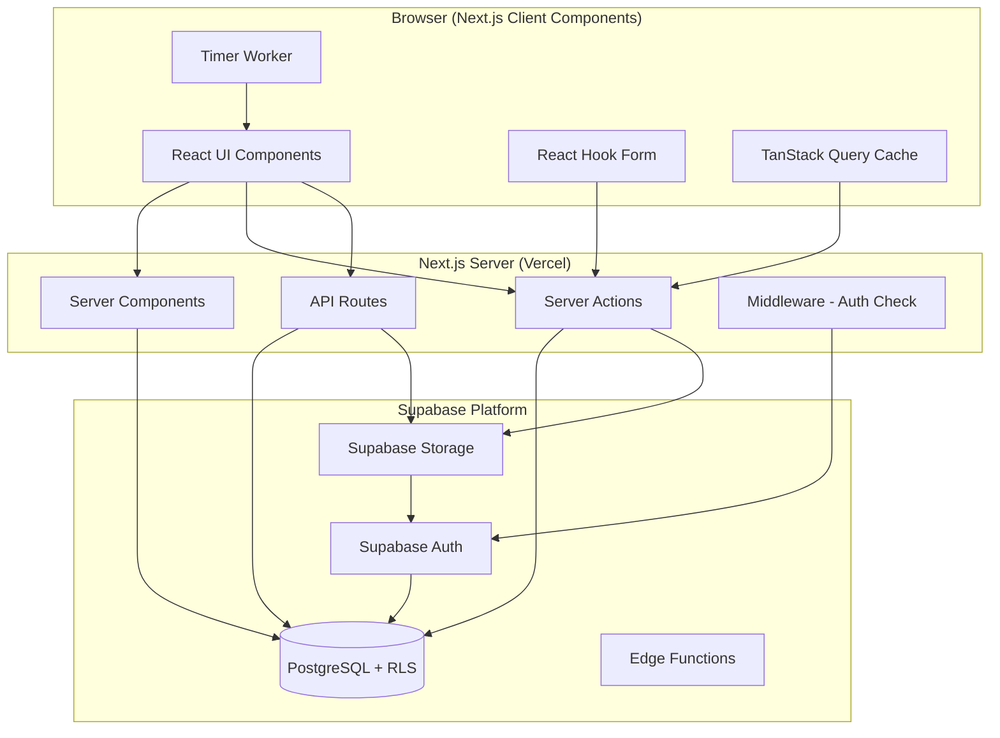
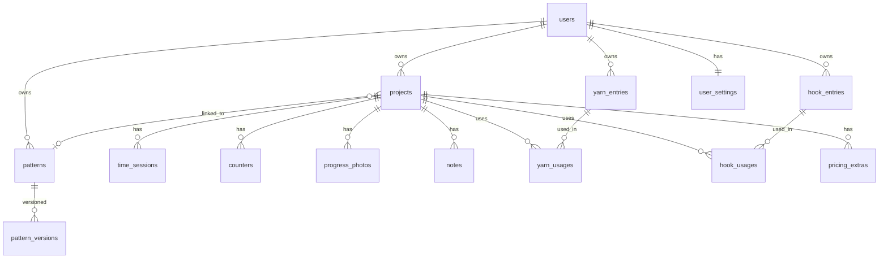
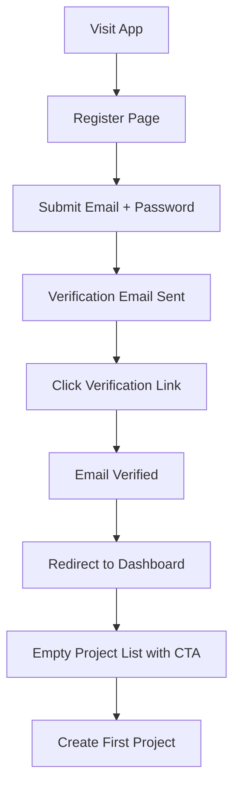
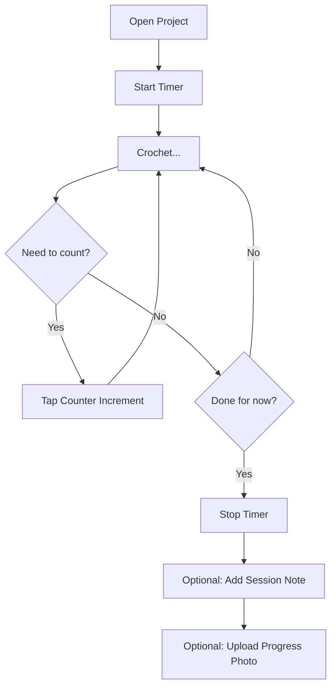
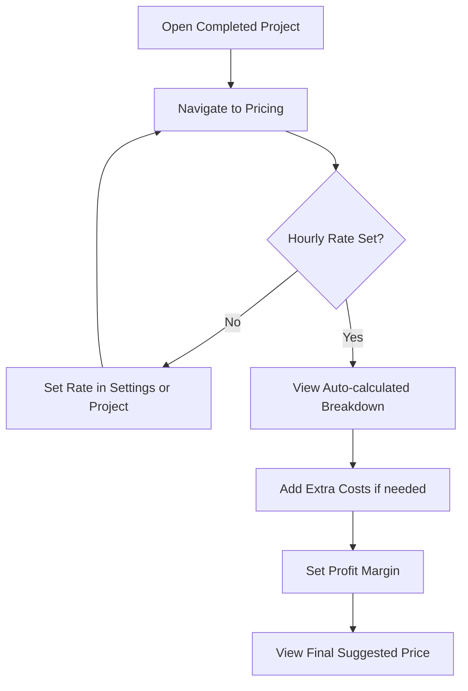
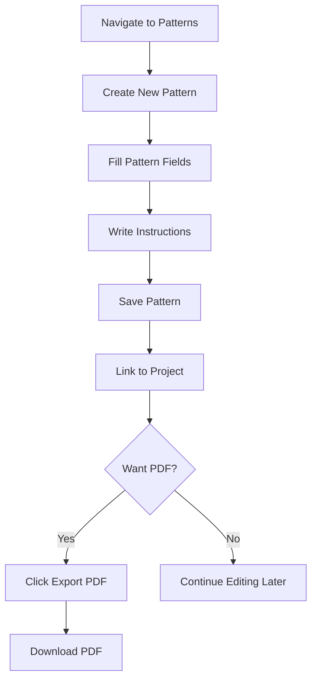

# Design Document: Crochet Project Tracker

## Overview

The Crochet Project Tracker is a full-stack web application built with Next.js (App Router) and Supabase that enables crocheters to manage projects, track time, maintain yarn/hook inventories, document progress, calculate pricing, and export patterns as PDFs.

The architecture follows a standard Next.js App Router pattern with Supabase handling authentication, database (PostgreSQL with Row-Level Security), and file storage. The application is server-rendered where possible for performance, with client-side interactivity for real-time features like timers and counters.

### Key Design Decisions

| Decision | Choice | Rationale |
|----------|--------|-----------|
| Framework | Next.js 14+ App Router | Server components for performance, API routes for server logic, built-in routing |
| Database | Supabase PostgreSQL | Managed Postgres with RLS, real-time subscriptions, auto-generated REST API |
| Auth | Supabase Auth | Integrated with RLS, email/password + magic link, handles password hashing |
| Storage | Supabase Storage | Signed URLs, bucket policies, integrated with auth, 50MB free tier |
| PDF Generation | @react-pdf/renderer | JSX-based PDF creation, server-side rendering in API routes, no headless browser needed |
| Styling | Tailwind CSS | Utility-first, responsive design, consistent design system |
| State Management | React Context + Server State (TanStack Query) | Minimal client state, server as source of truth |
| Form Handling | React Hook Form + Zod | Type-safe validation on client and server |

---

## Architecture

### System Architecture Diagram



### Request Flow

1. **Page Load**: Next.js middleware checks auth via Supabase SSR cookie → Server Component fetches data with RLS-scoped client → Renders HTML
2. **Mutations**: Client submits form → Server Action validates with Zod → Writes to Supabase DB → Revalidates cache
3. **File Upload**: Client selects file → Server Action creates signed upload URL → Client uploads directly to Supabase Storage → Server Action saves metadata to DB
4. **Timer**: Client-side interval updates UI → On stop, Server Action saves Time_Session record

### Folder Structure

```
src/
├── app/
│   ├── (auth)/
│   │   ├── login/page.tsx
│   │   ├── register/page.tsx
│   │   ├── verify-email/page.tsx
│   │   └── reset-password/page.tsx
│   ├── (dashboard)/
│   │   ├── layout.tsx
│   │   ├── projects/
│   │   │   ├── page.tsx              # Project list
│   │   │   ├── new/page.tsx          # Create project
│   │   │   └── [id]/
│   │   │       ├── page.tsx          # Project detail
│   │   │       ├── time/page.tsx     # Time sessions
│   │   │       ├── counters/page.tsx # Counters
│   │   │       ├── photos/page.tsx   # Progress photos
│   │   │       ├── notes/page.tsx    # Notes
│   │   │       └── pricing/page.tsx  # Pricing calculator
│   │   ├── yarn/
│   │   │   ├── page.tsx              # Yarn inventory
│   │   │   └── [id]/page.tsx         # Yarn detail
│   │   ├── hooks/
│   │   │   ├── page.tsx              # Hook collection
│   │   │   └── [id]/page.tsx         # Hook detail
│   │   ├── patterns/
│   │   │   ├── page.tsx              # Pattern list
│   │   │   ├── new/page.tsx          # Create pattern
│   │   │   └── [id]/
│   │   │       ├── page.tsx          # Pattern editor
│   │   │       └── export/route.ts   # PDF export API
│   │   └── settings/page.tsx         # User settings
│   ├── api/
│   │   └── pdf/[patternId]/route.ts  # PDF generation endpoint
│   ├── layout.tsx
│   └── page.tsx                      # Landing/redirect
├── components/
│   ├── ui/                           # Shared UI primitives
│   ├── projects/                     # Project-specific components
│   ├── timer/                        # Timer components
│   ├── counters/                     # Counter components
│   ├── yarn/                         # Yarn components
│   ├── hooks/                        # Hook components
│   ├── patterns/                     # Pattern components
│   ├── photos/                       # Photo components
│   └── pricing/                      # Pricing components
├── lib/
│   ├── supabase/
│   │   ├── client.ts                 # Browser client
│   │   ├── server.ts                 # Server client
│   │   └── middleware.ts             # Auth middleware helper
│   ├── validators/                   # Zod schemas
│   ├── actions/                      # Server Actions
│   ├── pricing.ts                    # Pricing calculation logic
│   └── pdf/                          # PDF template components
├── hooks/                            # Custom React hooks
│   ├── useTimer.ts
│   └── useCounter.ts
└── types/                            # TypeScript types
    └── database.ts                   # Generated Supabase types
```

---

## Components and Interfaces

### Page Components

#### Auth Pages
- **LoginPage**: Email/password form, link to register, link to reset password
- **RegisterPage**: Email/password form with confirmation, link to login
- **VerifyEmailPage**: Confirmation message, resend verification link
- **ResetPasswordPage**: Email input for reset link, new password form

#### Dashboard Pages
- **ProjectListPage**: Grid/list of projects with filter/sort controls, create button
- **ProjectDetailPage**: Tabbed interface showing project overview, linked yarn/hooks, and navigation to sub-pages
- **TimeTrackingPage**: Active timer display, session history list, manual entry form
- **CountersPage**: List of counters with increment/decrement/reset controls, add counter form
- **PhotosPage**: Photo grid with upload dropzone, chronological display
- **NotesPage**: Note list with category tabs, create/edit forms
- **PricingPage**: Calculator form with live breakdown display
- **YarnInventoryPage**: Searchable/filterable list, create/edit forms
- **YarnDetailPage**: Full yarn details, linked projects list
- **HookCollectionPage**: List of hooks, create/edit forms
- **PatternListPage**: List of patterns (uploaded + written), create button
- **PatternEditorPage**: Rich text editor for pattern sections, save/export controls
- **SettingsPage**: Default hourly rate, profile info, account deletion

### Shared Components

| Component | Props | Description |
|-----------|-------|-------------|
| `Timer` | `projectId, onSessionSave` | Start/stop timer with elapsed display |
| `Counter` | `counter, onIncrement, onDecrement, onReset, onEdit` | Single counter with controls |
| `PhotoUploader` | `projectId, maxSizeMB, onUploadComplete` | Drag-and-drop photo upload |
| `FileUploader` | `bucket, maxSizeMB, allowedTypes, onUploadComplete` | Generic file upload component |
| `PricingBreakdown` | `materialCost, timeCost, extras, profitMargin` | Formatted price breakdown |
| `ProjectCard` | `project` | Project summary card for list view |
| `ConfirmDialog` | `title, message, onConfirm, onCancel` | Confirmation modal for destructive actions |
| `FilterBar` | `filters, onFilterChange, onSortChange` | Filter/sort controls |
| `EmptyState` | `icon, title, description, action` | Empty state placeholder |

### Server Actions Interface

```typescript
// Project actions
createProject(data: ProjectFormData): Promise<Project>
updateProject(id: string, data: Partial<ProjectFormData>): Promise<Project>
deleteProject(id: string): Promise<void>

// Time tracking actions
startTimer(projectId: string): Promise<TimeSession>
stopTimer(sessionId: string): Promise<TimeSession>
updateTimeSession(id: string, data: Partial<TimeSessionData>): Promise<TimeSession>

// Counter actions
createCounter(projectId: string, data: CounterFormData): Promise<Counter>
incrementCounter(id: string): Promise<Counter>
decrementCounter(id: string): Promise<Counter>
resetCounter(id: string): Promise<Counter>
updateCounterValue(id: string, value: number): Promise<Counter>

// Yarn actions
createYarnEntry(data: YarnFormData): Promise<YarnEntry>
updateYarnEntry(id: string, data: Partial<YarnFormData>): Promise<YarnEntry>
deleteYarnEntry(id: string): Promise<void>
linkYarnToProject(yarnId: string, projectId: string, quantity: number): Promise<YarnUsage>

// Hook actions
createHookEntry(data: HookFormData): Promise<HookEntry>
updateHookEntry(id: string, data: Partial<HookFormData>): Promise<HookEntry>
deleteHookEntry(id: string): Promise<void>
linkHookToProject(hookId: string, projectId: string, note?: string): Promise<HookUsage>

// Pattern actions
createPattern(data: PatternFormData): Promise<Pattern>
updatePattern(id: string, data: Partial<PatternFormData>): Promise<Pattern>
exportPatternPdf(patternId: string): Promise<{ url: string }>

// Photo/Note actions
uploadPhoto(projectId: string, file: File): Promise<ProgressPhoto>
deletePhoto(id: string): Promise<void>
createNote(projectId: string, data: NoteFormData): Promise<Note>
updateNote(id: string, data: Partial<NoteFormData>): Promise<Note>
deleteNote(id: string): Promise<void>

// Pricing actions
calculatePrice(projectId: string, overrides?: PricingOverrides): Promise<PricingBreakdown>
```

---

## Data Models

### Database Schema Diagram



### Table Definitions

#### `user_settings`
| Column | Type | Constraints | Description |
|--------|------|-------------|-------------|
| id | uuid | PK, default gen_random_uuid() | |
| user_id | uuid | FK → auth.users, UNIQUE, NOT NULL | |
| default_hourly_rate | decimal(10,2) | nullable | Default rate for pricing |
| created_at | timestamptz | NOT NULL, default now() | |
| updated_at | timestamptz | NOT NULL, default now() | |

#### `projects`
| Column | Type | Constraints | Description |
|--------|------|-------------|-------------|
| id | uuid | PK, default gen_random_uuid() | |
| user_id | uuid | FK → auth.users, NOT NULL | Owner |
| name | varchar(255) | NOT NULL | Project name |
| description | text | nullable | Project description |
| status | varchar(20) | NOT NULL, default 'planned' | planned, in_progress, paused, completed, abandoned |
| difficulty | varchar(20) | nullable | beginner, easy, intermediate, advanced, expert |
| customer_name | varchar(255) | nullable | Optional customer |
| date_started | date | nullable | When work began |
| date_completed | date | nullable | When finished |
| hourly_rate_override | decimal(10,2) | nullable | Project-specific rate |
| pattern_id | uuid | FK → patterns, nullable | Linked pattern |
| created_at | timestamptz | NOT NULL, default now() | |
| updated_at | timestamptz | NOT NULL, default now() | |

#### `time_sessions`
| Column | Type | Constraints | Description |
|--------|------|-------------|-------------|
| id | uuid | PK, default gen_random_uuid() | |
| project_id | uuid | FK → projects, NOT NULL | |
| user_id | uuid | FK → auth.users, NOT NULL | |
| start_time | timestamptz | NOT NULL | Session start |
| end_time | timestamptz | nullable | Session end (null = running) |
| note | text | nullable | Optional session note |
| created_at | timestamptz | NOT NULL, default now() | |

#### `counters`
| Column | Type | Constraints | Description |
|--------|------|-------------|-------------|
| id | uuid | PK, default gen_random_uuid() | |
| project_id | uuid | FK → projects, NOT NULL | |
| user_id | uuid | FK → auth.users, NOT NULL | |
| name | varchar(100) | NOT NULL | Counter name |
| current_value | integer | NOT NULL, default 0, CHECK >= 0 | Current count |
| target_value | integer | nullable, CHECK > 0 | Optional target |
| sort_order | integer | NOT NULL, default 0 | Display order |
| created_at | timestamptz | NOT NULL, default now() | |
| updated_at | timestamptz | NOT NULL, default now() | |

#### `yarn_entries`
| Column | Type | Constraints | Description |
|--------|------|-------------|-------------|
| id | uuid | PK, default gen_random_uuid() | |
| user_id | uuid | FK → auth.users, NOT NULL | |
| name | varchar(255) | NOT NULL | Yarn name |
| brand | varchar(255) | nullable | Brand name |
| colour | varchar(100) | nullable | Colour name |
| shade_code | varchar(50) | nullable | Shade/colour code |
| dye_lot | varchar(50) | nullable | Dye lot number |
| weight_category | varchar(20) | nullable | lace, fingering, sport, dk, worsted, aran, bulky, super_bulky |
| thickness | varchar(50) | nullable | Thickness description |
| fibre_content | text | nullable | Fibre composition |
| washing_instructions | text | nullable | Care instructions |
| recommended_hook_size | varchar(20) | nullable | Suggested hook size |
| quantity_owned | decimal(10,2) | NOT NULL, default 0 | Quantity in stock |
| cost_per_unit | decimal(10,2) | nullable | Cost per skein/ball |
| photo_path | text | nullable | Storage path for photo |
| created_at | timestamptz | NOT NULL, default now() | |
| updated_at | timestamptz | NOT NULL, default now() | |

#### `yarn_usages`
| Column | Type | Constraints | Description |
|--------|------|-------------|-------------|
| id | uuid | PK, default gen_random_uuid() | |
| yarn_entry_id | uuid | FK → yarn_entries, NOT NULL | |
| project_id | uuid | FK → projects, NOT NULL | |
| user_id | uuid | FK → auth.users, NOT NULL | |
| quantity_used | decimal(10,2) | NOT NULL, default 0 | Amount used |
| created_at | timestamptz | NOT NULL, default now() | |
| updated_at | timestamptz | NOT NULL, default now() | |

#### `hook_entries`
| Column | Type | Constraints | Description |
|--------|------|-------------|-------------|
| id | uuid | PK, default gen_random_uuid() | |
| user_id | uuid | FK → auth.users, NOT NULL | |
| size | varchar(20) | NOT NULL | Hook size (e.g., 4.0mm, G/6) |
| type | varchar(50) | nullable | inline, tapered, etc. |
| brand | varchar(255) | nullable | Brand name |
| material | varchar(100) | nullable | aluminum, bamboo, steel, etc. |
| created_at | timestamptz | NOT NULL, default now() | |
| updated_at | timestamptz | NOT NULL, default now() | |

#### `hook_usages`
| Column | Type | Constraints | Description |
|--------|------|-------------|-------------|
| id | uuid | PK, default gen_random_uuid() | |
| hook_entry_id | uuid | FK → hook_entries, NOT NULL | |
| project_id | uuid | FK → projects, NOT NULL | |
| user_id | uuid | FK → auth.users, NOT NULL | |
| note | text | nullable | Which part of pattern used this hook |
| created_at | timestamptz | NOT NULL, default now() | |

#### `patterns`
| Column | Type | Constraints | Description |
|--------|------|-------------|-------------|
| id | uuid | PK, default gen_random_uuid() | |
| user_id | uuid | FK → auth.users, NOT NULL | |
| title | varchar(255) | NOT NULL | Pattern title |
| type | varchar(20) | NOT NULL | 'written' or 'uploaded' |
| introduction | text | nullable | Pattern intro (written type) |
| materials_list | text | nullable | Materials needed |
| hook_size | varchar(50) | nullable | Recommended hook |
| yarn_info | text | nullable | Yarn details |
| gauge | text | nullable | Gauge information |
| abbreviations | text | nullable | Stitch abbreviations |
| instructions | text | nullable | Pattern instructions |
| notes | text | nullable | Additional notes |
| file_path | text | nullable | Storage path (uploaded type) |
| file_name | varchar(255) | nullable | Original filename |
| created_at | timestamptz | NOT NULL, default now() | |
| updated_at | timestamptz | NOT NULL, default now() | |

#### `pattern_versions`
| Column | Type | Constraints | Description |
|--------|------|-------------|-------------|
| id | uuid | PK, default gen_random_uuid() | |
| pattern_id | uuid | FK → patterns, NOT NULL | |
| user_id | uuid | FK → auth.users, NOT NULL | |
| instructions | text | NOT NULL | Snapshot of instructions |
| version_number | integer | NOT NULL | Sequential version |
| created_at | timestamptz | NOT NULL, default now() | |

#### `progress_photos`
| Column | Type | Constraints | Description |
|--------|------|-------------|-------------|
| id | uuid | PK, default gen_random_uuid() | |
| project_id | uuid | FK → projects, NOT NULL | |
| user_id | uuid | FK → auth.users, NOT NULL | |
| file_path | text | NOT NULL | Storage path |
| file_name | varchar(255) | NOT NULL | Original filename |
| file_size | integer | NOT NULL | Size in bytes |
| mime_type | varchar(50) | NOT NULL | image/jpeg, image/png, image/webp |
| caption | text | nullable | Optional caption |
| is_final | boolean | NOT NULL, default false | Final project photo |
| created_at | timestamptz | NOT NULL, default now() | |

#### `notes`
| Column | Type | Constraints | Description |
|--------|------|-------------|-------------|
| id | uuid | PK, default gen_random_uuid() | |
| project_id | uuid | FK → projects, NOT NULL | |
| user_id | uuid | FK → auth.users, NOT NULL | |
| content | text | NOT NULL | Note content |
| category | varchar(30) | NOT NULL, default 'general' | general, remember_next_time, pattern_alteration |
| created_at | timestamptz | NOT NULL, default now() | |
| updated_at | timestamptz | NOT NULL, default now() | |

#### `pricing_extras`
| Column | Type | Constraints | Description |
|--------|------|-------------|-------------|
| id | uuid | PK, default gen_random_uuid() | |
| project_id | uuid | FK → projects, NOT NULL | |
| user_id | uuid | FK → auth.users, NOT NULL | |
| description | varchar(255) | NOT NULL | Extra cost description |
| amount | decimal(10,2) | NOT NULL | Cost amount |
| created_at | timestamptz | NOT NULL, default now() | |

### Row-Level Security Policies

Every table has RLS enabled with policies scoped to `auth.uid()`:

```sql
-- Example policy pattern applied to all tables
CREATE POLICY "Users can only access own data"
  ON projects
  FOR ALL
  USING (user_id = auth.uid())
  WITH CHECK (user_id = auth.uid());
```

### Storage Buckets

| Bucket | Access | Max File Size | Allowed MIME Types |
|--------|--------|---------------|-------------------|
| `progress-photos` | Private (signed URLs) | 10 MB | image/jpeg, image/png, image/webp |
| `pattern-files` | Private (signed URLs) | 20 MB | application/pdf, image/jpeg, image/png |
| `yarn-photos` | Private (signed URLs) | 5 MB | image/jpeg, image/png, image/webp |

All buckets use signed URLs with 1-hour expiration for read access.

---


## Correctness Properties

*A property is a characteristic or behavior that should hold true across all valid executions of a system—essentially, a formal statement about what the system should do. Properties serve as the bridge between human-readable specifications and machine-verifiable correctness guarantees.*

### Property 1: Project data round-trip

*For any* valid project data (including optional fields like customer_name, description, and difficulty), creating a project and then reading it back should return an object with all fields matching the original input. Similarly, for any valid partial update to a project, applying the update and reading back should reflect exactly the changed fields.

**Validates: Requirements 2.1, 2.3, 2.5**

### Property 2: Project status validation

*For any* string value, setting a project's status should succeed only if the value is one of: "planned", "in_progress", "paused", "completed", "abandoned". All other values should be rejected.

**Validates: Requirements 2.2**

### Property 3: Project list filtering and sorting

*For any* list of projects and any combination of filter criteria (status, difficulty) and sort field (date_started, status, difficulty), the filtered results should all satisfy the filter predicate, and the results should be ordered according to the specified sort direction.

**Validates: Requirements 2.8**

### Property 4: Time session total computation

*For any* set of completed time sessions (each with a start_time and end_time where end > start), the computed total time for the project should equal the sum of individual session durations (end_time - start_time) across all sessions.

**Validates: Requirements 3.5**

### Property 5: No duplicate running timers

*For any* project that has an active time session (end_time is null), attempting to start a new timer on that same project should be rejected and the existing session should remain unchanged.

**Validates: Requirements 3.8**

### Property 6: Counter arithmetic

*For any* counter with current value N, incrementing should yield N + 1. For any counter with current value N where N > 0, decrementing should yield N - 1. For any counter with current value 0, decrementing should yield 0 (floor at zero).

**Validates: Requirements 4.4, 4.5**

### Property 7: Counter value setting

*For any* non-negative integer V, setting a counter's value to V should persist that exact value. Resetting a counter (regardless of its current value) should always result in a value of 0.

**Validates: Requirements 4.6, 4.7**

### Property 8: Yarn entry data round-trip

*For any* valid yarn entry data (all field combinations including optional fields), creating a yarn entry and reading it back should return an object with all fields matching the original input. For any valid partial update, applying it and reading back should reflect the changes.

**Validates: Requirements 5.1, 5.2**

### Property 9: Yarn usage total computation

*For any* yarn entry linked to one or more projects with positive quantity_used values, the total quantity used displayed for that yarn entry should equal the sum of all individual yarn_usage quantities.

**Validates: Requirements 5.4, 5.6**

### Property 10: Pattern creation round-trip

*For any* valid pattern data (title, introduction, materials_list, hook_size, yarn_info, gauge, abbreviations, instructions, notes), creating a pattern and reading it back should return an object with all fields matching the original input.

**Validates: Requirements 7.2, 6.1**

### Property 11: Pattern version history preservation

*For any* sequence of N edits to a pattern's instructions field, the version history should contain exactly N entries, each preserving the exact text of the instructions at that point in time, in chronological order.

**Validates: Requirements 7.5**

### Property 12: Photo chronological ordering

*For any* set of progress photos with distinct created_at timestamps attached to a project, the display order should match ascending chronological order (oldest first).

**Validates: Requirements 8.6**

### Property 13: Pricing formula correctness

*For any* valid pricing inputs (material_cost ≥ 0, total_hours ≥ 0, hourly_rate > 0, extra_costs ≥ 0, profit_margin ≥ 0), the pricing calculator should compute: total = material_cost + (total_hours × hourly_rate) + sum(extra_costs) + profit_margin_amount. When a project-specific hourly rate is set, it should be used instead of the default rate. The profit margin should be correctly computed whether specified as a percentage of subtotal or as a fixed amount.

**Validates: Requirements 9.1, 9.3, 9.4, 9.6, 9.8**

### Property 14: PDF content fidelity

*For any* pattern with non-empty fields (title, materials_list, hook_size, gauge, abbreviations, instructions), the generated PDF should contain all of these fields, and the instructions text in the PDF should exactly match the user's original written instructions without alteration.

**Validates: Requirements 10.2, 10.6**

### Property 15: File type and size validation

*For any* file with a MIME type, the upload validator should accept only the allowed types for each context (progress photos: image/jpeg, image/png, image/webp; pattern files: application/pdf, image/jpeg, image/png). For any file exceeding the size limit (10 MB for photos, 20 MB for patterns), the upload should be rejected.

**Validates: Requirements 8.2, 11.6**

### Property 16: Input sanitization

*For any* user-provided string input containing HTML tags, script elements, or SQL injection patterns, the sanitization layer should neutralize dangerous content while preserving the safe textual meaning of the input.

**Validates: Requirements 11.4**

---

## Error Handling

### Error Categories and Strategies

| Category | Examples | Client Handling | Server Handling |
|----------|----------|-----------------|-----------------|
| Validation | Invalid form data, wrong file type, oversized file | Inline field errors via Zod, prevent submission | Return 400 with field-level error details |
| Authentication | Expired session, invalid token | Redirect to login, show session expired message | Return 401, clear session cookie |
| Authorization | Accessing another user's data (RLS violation) | Show "not found" (don't reveal existence) | Return 404 (not 403, to avoid data leakage) |
| Not Found | Deleted project, invalid ID | Show 404 page with back navigation | Return 404 |
| Conflict | Duplicate running timer, concurrent edit | Show conflict message with resolution options | Return 409 with conflict details |
| Storage | Upload failure, signed URL expired | Show retry button with error message | Return 500, log error, suggest retry |
| PDF Generation | Template rendering failure | Show error with retry option | Return 500, log error details |
| Network | Connection lost during timer | Queue action for retry, show offline indicator | N/A (client-side) |
| Rate Limit | Too many requests | Show "slow down" message, exponential backoff | Return 429 |

### Timer-Specific Error Handling

The timer presents unique challenges because it runs client-side but persists server-side:

1. **Browser tab closed while timer running**: On next visit, detect orphaned session (end_time is null, start_time > threshold ago), prompt user to either end the session at current time or discard it.
2. **Network failure on stop**: Queue the stop action locally, retry on reconnection, show "saving..." indicator.
3. **Clock skew**: Use server timestamps for start/end times (not client clock).

### File Upload Error Handling

1. **Pre-upload validation**: Check file type and size on client before upload attempt
2. **Signed URL expiration**: If upload takes too long, request a new signed URL
3. **Partial upload failure**: Show progress indicator, allow retry from beginning
4. **Storage quota exceeded**: Show clear message about storage limits

---

## Testing Strategy

### Testing Approach

The application uses a dual testing strategy combining unit/example-based tests with property-based tests for comprehensive coverage.

### Property-Based Testing

**Library**: [fast-check](https://github.com/dubzzz/fast-check) (TypeScript property-based testing)

**Configuration**:
- Minimum 100 iterations per property test
- Each property test references its design document property
- Tag format: `Feature: crochet-project-tracker, Property {number}: {property_text}`

**Properties to implement**:
- Properties 1-3: Project data operations (round-trip, validation, filtering)
- Properties 4-5: Time session logic (total computation, duplicate prevention)
- Properties 6-7: Counter arithmetic and value setting
- Properties 8-9: Yarn entry operations (round-trip, total computation)
- Properties 10-11: Pattern operations (round-trip, version history)
- Property 12: Photo ordering
- Property 13: Pricing formula
- Property 14: PDF content fidelity
- Properties 15-16: Validation (file types, input sanitization)

### Unit / Example-Based Testing

**Framework**: Vitest

**Coverage areas**:
- Auth flow integration (login, register, reset)
- Specific UI interactions (timer start/stop, counter tap targets)
- Error handling scenarios (upload failures, network errors)
- Edge cases (empty states, boundary values)
- Component rendering (correct elements present)

### Integration Testing

**Framework**: Vitest + Supabase local (via Docker)

**Coverage areas**:
- RLS policy enforcement (cross-user access denied)
- Cascade deletion (project deletion removes all associated data)
- File upload/download via signed URLs
- Auth flow end-to-end
- PDF generation produces valid PDF output

### Accessibility Testing

- Automated: axe-core integration in component tests
- Manual: Keyboard navigation, screen reader testing
- Note: Full WCAG 2.1 AA validation requires manual testing with assistive technologies and expert accessibility review

### Performance Testing

- Lighthouse CI for page load metrics (target: < 3s initial load)
- Bundle size monitoring

---

## User Flows

### Flow 1: New User Onboarding



### Flow 2: Active Crocheting Session



### Flow 3: Pricing a Finished Project



### Flow 4: Pattern Creation and Export



---

## Development Phases

### Phase 1: Foundation (Weeks 1-2)
- Next.js project setup with App Router
- Supabase project creation and configuration
- Database schema creation with RLS policies
- Authentication flow (register, login, verify email, reset password)
- Middleware for auth protection
- Basic layout and navigation shell
- User settings page (hourly rate)

### Phase 2: Core Project Management (Weeks 3-4)
- Project CRUD (create, read, update, delete with confirmation)
- Project list with filtering and sorting
- Project detail page with tabbed navigation
- Time tracking (timer UI, session storage, total calculation)
- Counter system (create, increment, decrement, reset, manual edit)

### Phase 3: Inventory Management (Weeks 5-6)
- Yarn inventory CRUD with all fields
- Yarn search and filtering
- Hook collection CRUD
- Linking yarn/hooks to projects (usage records)
- Yarn usage quantity tracking and totals

### Phase 4: Media and Notes (Week 7)
- Photo upload with drag-and-drop
- Photo display (chronological grid)
- File type and size validation
- Signed URL generation for photo access
- Notes CRUD with categories (general, remember next time, pattern alteration)

### Phase 5: Patterns and PDF (Week 8)
- Pattern creation (written patterns with all fields)
- Pattern file upload (PDF, images)
- Pattern version history
- Pattern linking to projects
- PDF export with @react-pdf/renderer
- PDF template design and content rendering

### Phase 6: Pricing Calculator (Week 9)
- Pricing formula implementation
- Breakdown display component
- Extra costs management
- Profit margin (percentage and fixed)
- Integration with time tracking data and yarn costs

### Phase 7: Polish and Launch (Weeks 10-11)
- Responsive design refinement (320px–2560px)
- Touch target sizing (44×44px minimum)
- Accessibility audit and fixes (WCAG 2.1 AA)
- Performance optimization (< 3s load)
- Error handling polish
- Account deletion flow
- End-to-end testing
- Deployment to Vercel

---

## Security and Privacy Considerations

### Authentication Security
- Supabase Auth handles password hashing (bcrypt) and token management
- Email verification required before full access
- Password reset via secure email token flow
- Session tokens stored in HTTP-only cookies via `@supabase/ssr`
- Generic error messages on login failure (don't reveal if email exists)

### Data Isolation (Row-Level Security)
- Every table has RLS enabled with `user_id = auth.uid()` policies
- Both SELECT and INSERT/UPDATE/DELETE policies enforced
- Foreign key relationships validated server-side (can't link to another user's yarn/hooks)
- API responses for unauthorized access return 404 (not 403) to prevent data enumeration

### File Storage Security
- All storage buckets are private (no public access)
- Files accessed via signed URLs with 1-hour expiration
- Upload validation enforces:
  - Allowed MIME types per bucket
  - Maximum file sizes (10 MB photos, 20 MB patterns)
  - File content type verification (not just extension)
- Storage bucket policies restrict access to authenticated users' own files

### Input Validation and Sanitization
- Client-side: Zod schemas validate all form inputs before submission
- Server-side: Same Zod schemas re-validate in Server Actions
- Text inputs sanitized to prevent XSS (HTML entities escaped)
- File names sanitized (stripped of path traversal characters)
- SQL injection prevented by Supabase's parameterized queries (PostgREST)

### Data Deletion and Privacy
- Account deletion triggers cascade removal of all user data
- Deletion completed within 30 days (soft delete → hard delete via scheduled job)
- Storage files removed when associated records are deleted
- No data shared between users (single-tenant data model)

### Transport Security
- All traffic served over HTTPS (enforced by Vercel)
- Supabase connections use TLS
- No sensitive data in URL parameters

### Rate Limiting
- Supabase Auth has built-in rate limiting for auth endpoints
- API routes should implement rate limiting for file uploads and PDF generation
- Consider Vercel Edge Middleware for additional rate limiting if needed
