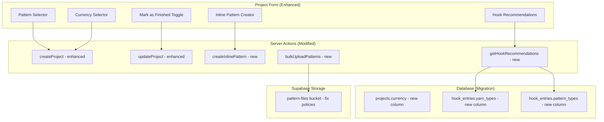

# Design Document: Project, Pattern & Hooks Enhancements

## Overview

This design covers a set of enhancements to the existing "Wired for Crochet" application. The changes span multiple areas of the app:

1. **Project-Pattern Linking** — Add a pattern selector to the project form and allow inline pattern creation
2. **Project Completion Tracking** — "Mark as finished" toggle with date_completed integration
3. **Per-Project Currency** — New `currency` column on projects, currency-aware pricing display
4. **Bulk Pattern Upload** — Multi-file upload with batch progress tracking
5. **Hook Compatibility Metadata** — New `yarn_types` and `pattern_types` JSONB columns on hook_entries
6. **Hook Recommendation Suggestions** — Query hooks by compatibility metadata when creating/editing projects
7. **Pattern Upload Fix** — Investigate and fix the Supabase Storage bucket configuration for pattern-files

### Key Design Decisions

| Decision | Choice | Rationale |
|----------|--------|-----------|
| Currency storage | varchar(3) column with ISO 4217 codes | Simple, standard, no conversion needed — display-only |
| Hook compatibility storage | JSONB arrays | Supports efficient `@>` containment queries in PostgreSQL, flexible for custom values |
| Inline pattern creation | Two-step server action (create pattern → link to project) | Keeps pattern creation logic reusable, handles partial failure gracefully |
| Bulk upload | Client-side parallel uploads with server-side metadata creation | Maximizes upload throughput, individual failure isolation |
| Pattern upload fix | Storage policy audit + bucket verification | Root cause is likely missing/misconfigured RLS policies on the pattern-files bucket |

---

## Architecture

### Enhancement Integration Points



### Request Flows

**Pattern Selection in Project Form:**
1. Project form loads → fetches user's patterns via `getPatterns()`
2. User selects pattern from dropdown → `pattern_id` included in form submission
3. Server action validates UUID → stores in projects table

**Inline Pattern Creation:**
1. User clicks "Create new pattern" in project form
2. Inline form fields appear (title, type, etc.)
3. On project save → `createInlinePattern()` creates pattern first
4. If pattern creation succeeds → project is saved with new `pattern_id`
5. If pattern creation fails → error shown, project not saved

**Hook Recommendations:**
1. User selects yarn type or pattern type in project form
2. Client calls `getHookRecommendations({ yarnTypes, patternTypes })`
3. Server queries `hook_entries` using JSONB `@>` containment operator
4. Results displayed as non-blocking suggestion chips

**Bulk Pattern Upload:**
1. User selects multiple files via file picker
2. Client validates each file (size ≤ 20MB, allowed MIME type)
3. For each valid file: upload to `pattern-files/{user_id}/{uuid}_{filename}`
4. On upload success: create pattern record with `type: 'uploaded'`, derive title from filename
5. Display per-file status and final summary

---

## Components and Interfaces

### New/Modified Server Actions

```typescript
// src/lib/actions/projects.ts (modified)
export async function createProject(
  _prevState: ProjectActionState,
  formData: FormData
): Promise<ProjectActionState>
// Now handles: pattern_id, currency, date_completed with "mark as finished" logic

export async function updateProject(
  id: string,
  _prevState: ProjectActionState,
  formData: FormData
): Promise<ProjectActionState>
// Now handles: currency updates, mark-as-finished toggle, clearing pattern_id

// src/lib/actions/patterns.ts (new function)
export async function createInlinePattern(
  _prevState: PatternActionState,
  formData: FormData
): Promise<PatternActionState & { patternId?: string }>
// Creates pattern and returns its ID for linking to project

export async function bulkUploadPatterns(
  files: { name: string; path: string; size: number; mimeType: string }[]
): Promise<{ results: Array<{ fileName: string; success: boolean; error?: string; patternId?: string }> }>
// Batch creates pattern records after files are uploaded to storage

// src/lib/actions/hooks.ts (modified + new)
export async function createHookEntry(...)
// Now handles: yarn_types, pattern_types JSONB arrays

export async function updateHookEntry(...)
// Now handles: yarn_types, pattern_types JSONB arrays

export async function getHookRecommendations(options: {
  yarnTypes?: string[]
  patternTypes?: string[]
}): Promise<{ data: HookEntry[] | null; error: string | null }>
// Queries hook_entries where yarn_types or pattern_types contain matching values
```

### New/Modified UI Components

| Component | Location | Description |
|-----------|----------|-------------|
| `PatternSelector` | `src/components/projects/PatternSelector.tsx` | Searchable dropdown listing user's patterns, with "Create new" option |
| `InlinePatternForm` | `src/components/projects/InlinePatternForm.tsx` | Collapsible form for creating a pattern inline within project form |
| `MarkAsFinishedToggle` | `src/components/projects/MarkAsFinishedToggle.tsx` | Toggle + date picker that sets status to "completed" and date_completed |
| `CurrencySelector` | `src/components/projects/CurrencySelector.tsx` | Dropdown with common currency codes (USD, GBP, EUR, AUD, CAD, NZD) |
| `HookRecommendations` | `src/components/hooks/HookRecommendations.tsx` | Suggestion panel showing matching hooks based on yarn/pattern type |
| `BulkPatternUploader` | `src/components/patterns/BulkPatternUploader.tsx` | Multi-file picker with progress indicators and batch summary |
| `HookCompatibilityFields` | `src/components/hooks/HookCompatibilityFields.tsx` | Multi-select fields for yarn_types and pattern_types on hook form |
| `PricingBreakdown` (modified) | `src/components/pricing/PricingBreakdown.tsx` | Now accepts currency prop and formats amounts with correct symbol |

### Modified Pages

- `src/app/(dashboard)/projects/new/page.tsx` — Add PatternSelector, CurrencySelector, MarkAsFinishedToggle, HookRecommendations
- `src/app/(dashboard)/projects/[id]/page.tsx` — Display linked pattern info with link to pattern detail
- `src/app/(dashboard)/projects/[id]/pricing/page.tsx` — Pass currency to PricingBreakdown
- `src/app/(dashboard)/hooks/new/page.tsx` — Add HookCompatibilityFields
- `src/app/(dashboard)/hooks/[id]/edit/HookEditForm.tsx` — Add HookCompatibilityFields
- `src/app/(dashboard)/hooks/[id]/HookDetailClient.tsx` — Display yarn_types/pattern_types as badges
- `src/app/(dashboard)/patterns/page.tsx` — Add BulkPatternUploader
- `src/app/(dashboard)/patterns/new/page.tsx` — Fix file upload flow

---

## Data Models

### Database Migration

A single new migration file adds the `currency` column to projects and `yarn_types`/`pattern_types` columns to hook_entries:

```sql
-- Migration: project-pattern-hooks-enhancements
-- Adds currency to projects, compatibility metadata to hook_entries

-- 1. Add currency column to projects (default USD)
ALTER TABLE projects
  ADD COLUMN currency varchar(3) NOT NULL DEFAULT 'USD';

-- 2. Add JSONB compatibility columns to hook_entries
ALTER TABLE hook_entries
  ADD COLUMN yarn_types jsonb DEFAULT '[]'::jsonb,
  ADD COLUMN pattern_types jsonb DEFAULT '[]'::jsonb;

-- 3. Create GIN indexes for efficient JSONB containment queries
CREATE INDEX idx_hook_entries_yarn_types ON hook_entries USING GIN (yarn_types);
CREATE INDEX idx_hook_entries_pattern_types ON hook_entries USING GIN (pattern_types);
```

### Updated TypeScript Types

```typescript
// Additions to src/types/database.ts

// hook_entries table updates
hook_entries: {
  Row: {
    // ... existing fields ...
    yarn_types: string[] | null;      // JSONB array of yarn type strings
    pattern_types: string[] | null;   // JSONB array of pattern type strings
  };
  Insert: {
    // ... existing fields ...
    yarn_types?: string[] | null;
    pattern_types?: string[] | null;
  };
  Update: {
    // ... existing fields ...
    yarn_types?: string[] | null;
    pattern_types?: string[] | null;
  };
};

// projects table updates
projects: {
  Row: {
    // ... existing fields ...
    currency: string;  // ISO 4217 code, default 'USD'
  };
  Insert: {
    // ... existing fields ...
    currency?: string;
  };
  Update: {
    // ... existing fields ...
    currency?: string;
  };
};
```

### Updated Zod Validators

```typescript
// src/lib/validators/project.ts additions
export const SUPPORTED_CURRENCIES = ['USD', 'GBP', 'EUR', 'AUD', 'CAD', 'NZD'] as const;

export const projectFormSchema = z.object({
  // ... existing fields ...
  currency: z.enum(SUPPORTED_CURRENCIES).default('USD'),
});

// src/lib/validators/hook.ts additions
export const YARN_TYPE_OPTIONS = [
  'cotton', 'acrylic', 'chunky', 'wool', 'bamboo', 'silk', 'polyester'
] as const;

export const PATTERN_TYPE_OPTIONS = [
  'amigurumi', 'blankets', 'garments', 'lace', 'accessories', 'home decor'
] as const;

export const hookFormSchema = z.object({
  // ... existing fields ...
  yarn_types: z.array(z.string().max(50)).max(20).default([]),
  pattern_types: z.array(z.string().max(50)).max(20).default([]),
});
```

### Hook Recommendation Query

The recommendation query uses PostgreSQL's JSONB containment operator (`@>`):

```sql
-- Find hooks compatible with given yarn types OR pattern types
SELECT * FROM hook_entries
WHERE user_id = $1
  AND (
    yarn_types @> $2::jsonb    -- contains any of the specified yarn types
    OR pattern_types @> $3::jsonb  -- contains any of the specified pattern types
  );
```

In Supabase client code:
```typescript
const { data } = await supabase
  .from('hook_entries')
  .select('*')
  .eq('user_id', user.id)
  .or(
    `yarn_types.cs.${JSON.stringify(yarnTypes)},pattern_types.cs.${JSON.stringify(patternTypes)}`
  )
```

### Storage Bucket Fix

The pattern-files bucket needs:
1. **Bucket existence verification** — Check bucket exists via Supabase dashboard or migration
2. **RLS policies** — Users can upload to `{user_id}/` prefix, read their own files
3. **File path convention** — `pattern-files/{user_id}/{uuid}_{original_filename}`

Expected storage policies:
```sql
-- Allow authenticated users to upload to their own folder
CREATE POLICY "Users can upload pattern files"
  ON storage.objects FOR INSERT
  WITH CHECK (
    bucket_id = 'pattern-files'
    AND auth.uid()::text = (storage.foldername(name))[1]
  );

-- Allow authenticated users to read their own files
CREATE POLICY "Users can read own pattern files"
  ON storage.objects FOR SELECT
  USING (
    bucket_id = 'pattern-files'
    AND auth.uid()::text = (storage.foldername(name))[1]
  );

-- Allow authenticated users to delete their own files
CREATE POLICY "Users can delete own pattern files"
  ON storage.objects FOR DELETE
  USING (
    bucket_id = 'pattern-files'
    AND auth.uid()::text = (storage.foldername(name))[1]
  );
```

### Currency Display Utility

```typescript
// src/lib/currency.ts
const CURRENCY_SYMBOLS: Record<string, string> = {
  USD: '$',
  GBP: '£',
  EUR: '€',
  AUD: 'A$',
  CAD: 'C$',
  NZD: 'NZ$',
};

export function formatCurrency(amount: number, currencyCode: string): string {
  const symbol = CURRENCY_SYMBOLS[currencyCode] ?? currencyCode;
  return `${symbol}${amount.toFixed(2)}`;
}
```


---

## Correctness Properties

*A property is a characteristic or behavior that should hold true across all valid executions of a system—essentially, a formal statement about what the system should do. Properties serve as the bridge between human-readable specifications and machine-verifiable correctness guarantees.*

### Property 1: Pattern linking round-trip

*For any* valid pattern ID belonging to the user, creating or updating a project with that pattern_id and then reading the project back should return the same pattern_id. Similarly, for any valid inline pattern data submitted with a project, the system should create a pattern record and the resulting project's pattern_id should reference that new pattern.

**Validates: Requirements 1.2, 2.3**

### Property 2: Pattern search filtering

*For any* set of patterns with various titles and any non-empty search query string, filtering the pattern list by that query should return only patterns whose title contains the query as a case-insensitive substring, and all such matching patterns should be included in the results.

**Validates: Requirements 1.5**

### Property 3: Inline pattern validator consistency

*For any* pattern input data (valid or invalid), running it through the inline pattern validation logic should produce the same accept/reject outcome as running it through the standalone `patternFormSchema` validator.

**Validates: Requirements 2.6**

### Property 4: Mark-as-finished sets completed status

*For any* project in any non-completed status, when the "mark as finished" flag is set to true, the resulting project status should always be "completed" and date_completed should be a valid date (either user-provided or defaulting to today).

**Validates: Requirements 3.2, 3.4**

### Property 5: Mark-as-finished toggle off reverts status

*For any* project that was previously in a non-completed status and then marked as finished, deactivating the "mark as finished" toggle should restore the project's status to its previous value and set date_completed to null.

**Validates: Requirements 3.6**

### Property 6: Currency persistence round-trip

*For any* supported currency code (USD, GBP, EUR, AUD, CAD, NZD), saving it on a project and reading the project back should return the same currency code. When no currency is specified, the project should have currency set to "USD".

**Validates: Requirements 4.2, 4.3**

### Property 7: Currency formatting correctness

*For any* non-negative monetary amount and any supported currency code, the `formatCurrency` function should produce a string that starts with the correct currency symbol for that code and contains the amount formatted to exactly two decimal places.

**Validates: Requirements 4.4**

### Property 8: File validation rules

*For any* file metadata (size in bytes, MIME type string), the file validator should accept the file if and only if: (a) the size is ≤ 20 MB (20,971,520 bytes), AND (b) the MIME type is one of "application/pdf", "image/jpeg", or "image/png". The client-side and server-side validators should produce identical results for the same input.

**Validates: Requirements 5.2, 5.8, 5.9, 8.6, 8.7**

### Property 9: Title derivation from filename

*For any* filename string containing at least one dot character, the derived pattern title should equal the filename with the last extension (including the dot) removed. For filenames without a dot, the title should equal the full filename.

**Validates: Requirements 5.4**

### Property 10: Batch upload summary counts

*For any* batch of N file upload results where S succeeded and F failed, the computed summary should report exactly S successes and F failures, and S + F should equal N.

**Validates: Requirements 5.10**

### Property 11: Hook compatibility data round-trip

*For any* hook entry and any arrays of yarn type strings and pattern type strings (including empty arrays and arrays with custom values), saving the compatibility data and reading the hook entry back should return arrays with the same elements in the same order.

**Validates: Requirements 6.3, 6.4**

### Property 12: Hook recommendation query correctness

*For any* set of hook entries with various yarn_types and pattern_types arrays, and any query specifying target yarn types or pattern types, the recommendation results should include exactly those hooks where at least one element of the hook's yarn_types matches the query's yarn types OR at least one element of the hook's pattern_types matches the query's pattern types. Hooks with no matching elements should not appear in results.

**Validates: Requirements 7.1**

### Property 13: Pattern file metadata persistence

*For any* successfully uploaded file with a known original filename and storage path, the resulting pattern record should have file_path set to the storage path and file_name set to the original filename, and these values should be retrievable on subsequent reads.

**Validates: Requirements 8.3**

---

## Error Handling

### Error Scenarios by Feature

| Feature | Error Scenario | Handling Strategy |
|---------|---------------|-------------------|
| Pattern Linking | Pattern ID doesn't exist or belongs to another user | Validate UUID exists in user's patterns before saving; return field error |
| Inline Pattern Creation | Pattern validation fails | Show inline field errors, prevent project save |
| Inline Pattern Creation | Pattern saves but project fails | Retain pattern in library, show error explaining pattern was created but project wasn't |
| Mark as Finished | Invalid date format | Zod validation rejects non-ISO date strings; show field error |
| Currency | Invalid currency code | Zod enum validation rejects; show field error |
| Bulk Upload | Individual file exceeds 20MB | Client-side rejection before upload attempt; show per-file error |
| Bulk Upload | Individual file has wrong MIME type | Client-side rejection; show per-file error |
| Bulk Upload | Storage upload fails for one file | Continue remaining uploads; show per-file error indicator |
| Bulk Upload | All uploads fail | Show summary with 0 successes, N failures; suggest checking connection |
| Hook Compatibility | Invalid JSON array data | Zod array validation; show field error |
| Hook Recommendations | Query returns no results | Hide suggestion section entirely (non-blocking) |
| Pattern Upload | Bucket doesn't exist | Log server error with bucket name; show "upload service temporarily unavailable" |
| Pattern Upload | RLS policy denies access | Log policy error; show "permission denied" with suggestion to re-login |
| Pattern Upload | Network timeout during upload | Show retry button; preserve file selection |
| Pattern Upload | Signed URL generation fails | Log error; show "unable to generate download link" |

### Partial Failure Handling

**Inline Pattern + Project Save:**
```
1. Validate pattern data → fail fast with field errors
2. Validate project data → fail fast with field errors
3. Create pattern record → if fails, return error, don't create project
4. Create project with pattern_id → if fails, return error explaining pattern was created
5. Success → return project ID
```

**Bulk Upload:**
```
1. Client validates all files (size + type) → reject invalid files immediately
2. For each valid file in parallel:
   a. Upload to storage → on failure, mark file as failed, continue
   b. Create pattern record → on failure, mark file as failed (orphan file in storage is acceptable)
3. Collect results → display summary
```

### Client-Side Validation

All validation is performed client-side first for immediate feedback, then repeated server-side for security:
- File size: `file.size <= 20 * 1024 * 1024`
- MIME type: `['application/pdf', 'image/jpeg', 'image/png'].includes(file.type)`
- Currency: Must be one of the supported codes
- Yarn/pattern types: Array of strings, each ≤ 50 chars, max 20 items

---

## Testing Strategy

### Testing Approach

The application uses a dual testing strategy combining unit/example-based tests with property-based tests for comprehensive coverage.

### Property-Based Testing

**Library**: [fast-check](https://github.com/dubzzz/fast-check) (TypeScript property-based testing)

**Configuration**:
- Minimum 100 iterations per property test
- Each property test references its design document property
- Tag format: `Feature: project-pattern-hooks-enhancements, Property {number}: {property_text}`

**Properties to implement**:
- Property 1: Pattern linking round-trip (test createProject/updateProject with pattern_id)
- Property 2: Pattern search filtering (test filter function with random patterns and queries)
- Property 3: Inline pattern validator consistency (test both validators produce same results)
- Property 4: Mark-as-finished sets completed (test status transition logic)
- Property 5: Mark-as-finished toggle off reverts (test status reversion logic)
- Property 6: Currency persistence round-trip (test save/read cycle for currency)
- Property 7: Currency formatting correctness (test `formatCurrency` pure function)
- Property 8: File validation rules (test `validatePatternFile` pure function)
- Property 9: Title derivation from filename (test `deriveTitleFromFilename` pure function)
- Property 10: Batch upload summary counts (test summary computation pure function)
- Property 11: Hook compatibility data round-trip (test save/read cycle for JSONB arrays)
- Property 12: Hook recommendation query correctness (test filtering logic with mock data)
- Property 13: Pattern file metadata persistence (test save/read cycle for file_path/file_name)

### Unit / Example-Based Testing

**Framework**: Vitest

**Coverage areas**:
- UI component rendering (pattern selector, currency dropdown, hook compatibility fields)
- Toggle interactions (mark as finished show/hide date field)
- Bulk upload progress UI states
- Error message display for various failure scenarios
- Default value behavior (currency defaults to USD, date defaults to today)
- Edge cases: empty pattern library, no hooks with compatibility data, zero-file batch

### Integration Testing

**Framework**: Vitest + Supabase local

**Coverage areas**:
- Storage bucket existence and policy verification
- File upload end-to-end (upload → signed URL → download)
- Cross-user access denied (RLS enforcement on new columns)
- Migration verification (new columns exist with correct types and defaults)
- Hook recommendation query with GIN index (verify performance with larger datasets)

### Test File Organization

```
src/
├── lib/
│   ├── __tests__/
│   │   ├── currency.test.ts           # Property 7: formatCurrency
│   │   ├── file-validation.test.ts    # Property 8: validatePatternFile
│   │   ├── filename-title.test.ts     # Property 9: deriveTitleFromFilename
│   │   ├── batch-summary.test.ts      # Property 10: computeBatchSummary
│   │   └── pattern-filter.test.ts     # Property 2: filterPatternsByTitle
│   ├── actions/
│   │   └── __tests__/
│   │       ├── projects.test.ts       # Properties 1, 4, 5, 6
│   │       ├── hooks.test.ts          # Properties 11, 12
│   │       └── patterns.test.ts       # Properties 3, 13
```
